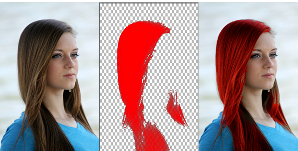

# Styling and Coloring with Hair Segmentation

[ ](https://app.codeship.com/projects/297281)
[](http://twitter.com/fritzlabs)

In this app, we automatically blend a color mask with the user's hair, transforming it to red.



For the full tutorial, visit [our post on Heartbeat](https://heartbeat.fritz.ai/embrace-your-new-look-with-hair-segmentation-by-fritz-now-available-for-android-developers-f20f5b4e9ae1).

This example app uses the on-device Hair Segmentation API for Android.

- [Overview](https://www.fritz.ai/features/image-segmentation.html)
- [Documentation](https://docs.fritz.ai/develop/vision/image-segmentation/android.html)

## Requirements

- Android Studio 3.2 or above
- Android device in developer model (USB debugging enabled)

## Getting Started

**Step 1: Create a Fritz Account**

In order to use Fritz, please [register for a free account](https://app.fritz.ai/register).

**Step 2: Clone / Fork the fritz-android-tutorials repository and open the HairColoringApp in Android Studio**

```
git clone https://github.com/fritzlabs/fritz-android-tutorials.git
```

In Android Studio, choose "Open an existing Android Studio project" and select `HairColoringApp`.

**Step 3: Build the Android Studio Project**

Select "Build > Make Project" from the top nav. Download any missing libraries if applicable. This should sync the gradle dependencies so give the build a second to complete.

**Step 4: Install the app onto your device**

With your Android device connected, select `Run > Run App` from the top nav. When running the app for the first time, you'll have to give permissions to access the camera. After the app is installed and running, point your camera at someone's hair to automatically color it.

## Official Documentation

[SDK Documentation](https://docs.fritz.ai/)

[Android API Docs](https://docs.fritz.ai/android/latest/index.html)

## Help

For any questions or issues, you can:

- Submit an issue on this repo
- Go to our [Help Center](https://docs.fritz.ai/help-center/index.html)
- Message us directly in [Slack](https://join.slack.com/t/heartbeat-by-fritz/shared_invite/enQtNTY5NDM2MTQwMTgwLTAyODE3MmQzZjU2NWE5MDNmYTgwM2E1MjU5Y2Y2NmI2YTlkMTMwZTAwYTAwMzQ5NzQ2NDBhZjhmYjU2YWY3OGU)
